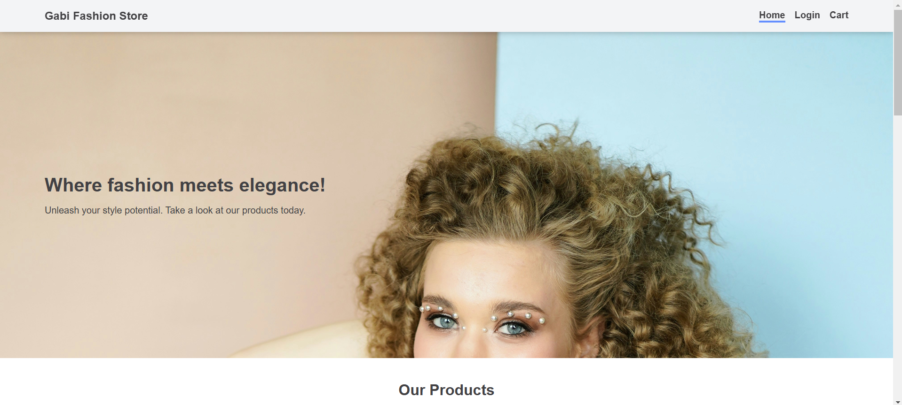
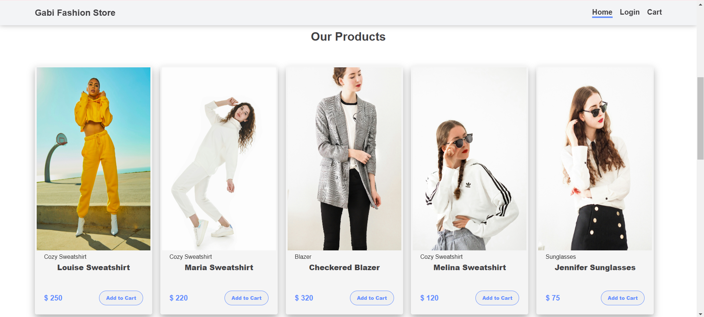
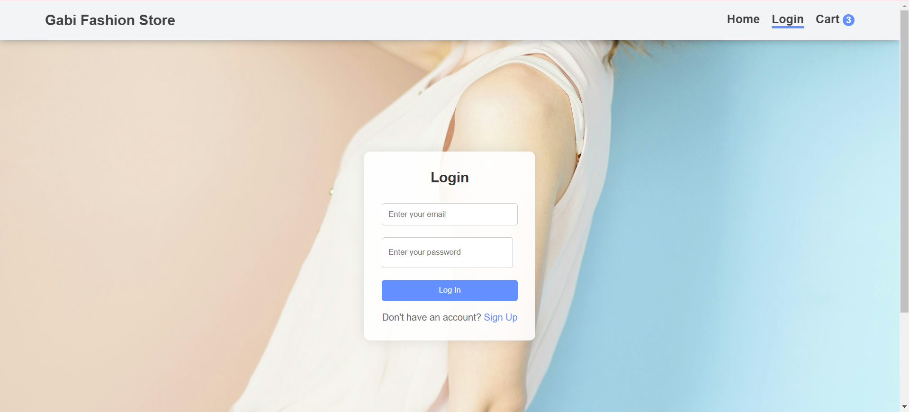
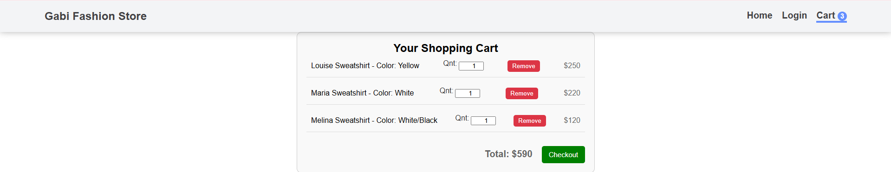

# Ecommerce Project for Web Development Course

This ecommerce project was developed as part of the Web Development course in my Mobile Solutions postgraduate program. The project utilizes ReactJS for the frontend, Express NodeJS for the backend, and MongoDB with Mongoose for the database.

## Screenshots






## Setup Instructions
1. Clone the repository.
2. Navigate to the `server` directory and create a `config.js` file. Set the MongoDB URL in the `config.js` file.
   Example `config.js`:
   
   ```javascript
   module.exports = {
       mongoURI: 'YOUR_MONGODB_URL_HERE'
   };
3. Run the following command to build the project and generate the node_modules folder in both the client and server directories:
`npm install`
4. To start the server, navigate to the server directory and run:
`npm start`
5. To start the client, navigate to the client directory and run:
`npm start`

## Resources
- [React JS](https://reactjs.org/)
- [Express NodeJS](https://expressjs.com/)
- [MongoDB](https://www.mongodb.com/)
- [Mongoose](https://mongoosejs.com/)
- [YouTube Tutorial 1](https://www.youtube.com/watch?v=w3vs4a03y3I)
- [YouTube Tutorial 2](https://www.youtube.com/watch?v=Eg060ApBhT4)
- [YouTube Tutorial 3](https://www.youtube.com/watch?v=9kHO3V2Iffo)
- [Unsplash - Free images](https://unsplash.com/s/photos/woman-clothes-style?license=free)


# DEFAULT REACT INSTRUCTIONS
# Getting Started with Create React App

This project was bootstrapped with [Create React App](https://github.com/facebook/create-react-app).

## Available Scripts

In the project directory, you can run:

### `npm start`

Runs the app in the development mode.\
Open [http://localhost:3000](http://localhost:3000) to view it in your browser.

The page will reload when you make changes.\
You may also see any lint errors in the console.

### `npm test`

Launches the test runner in the interactive watch mode.\
See the section about [running tests](https://facebook.github.io/create-react-app/docs/running-tests) for more information.

### `npm run build`

Builds the app for production to the `build` folder.\
It correctly bundles React in production mode and optimizes the build for the best performance.

The build is minified and the filenames include the hashes.\
Your app is ready to be deployed!

See the section about [deployment](https://facebook.github.io/create-react-app/docs/deployment) for more information.

### `npm run eject`

**Note: this is a one-way operation. Once you `eject`, you can't go back!**

If you aren't satisfied with the build tool and configuration choices, you can `eject` at any time. This command will remove the single build dependency from your project.

Instead, it will copy all the configuration files and the transitive dependencies (webpack, Babel, ESLint, etc) right into your project so you have full control over them. All of the commands except `eject` will still work, but they will point to the copied scripts so you can tweak them. At this point you're on your own.

You don't have to ever use `eject`. The curated feature set is suitable for small and middle deployments, and you shouldn't feel obligated to use this feature. However we understand that this tool wouldn't be useful if you couldn't customize it when you are ready for it.

## Learn More

You can learn more in the [Create React App documentation](https://facebook.github.io/create-react-app/docs/getting-started).

To learn React, check out the [React documentation](https://reactjs.org/).

### Code Splitting

This section has moved here: [https://facebook.github.io/create-react-app/docs/code-splitting](https://facebook.github.io/create-react-app/docs/code-splitting)

### Analyzing the Bundle Size

This section has moved here: [https://facebook.github.io/create-react-app/docs/analyzing-the-bundle-size](https://facebook.github.io/create-react-app/docs/analyzing-the-bundle-size)

### Making a Progressive Web App

This section has moved here: [https://facebook.github.io/create-react-app/docs/making-a-progressive-web-app](https://facebook.github.io/create-react-app/docs/making-a-progressive-web-app)

### Advanced Configuration

This section has moved here: [https://facebook.github.io/create-react-app/docs/advanced-configuration](https://facebook.github.io/create-react-app/docs/advanced-configuration)

### Deployment

This section has moved here: [https://facebook.github.io/create-react-app/docs/deployment](https://facebook.github.io/create-react-app/docs/deployment)

### `npm run build` fails to minify

This section has moved here: [https://facebook.github.io/create-react-app/docs/troubleshooting#npm-run-build-fails-to-minify](https://facebook.github.io/create-react-app/docs/troubleshooting#npm-run-build-fails-to-minify)
